# Transport Mobile apps using SAP Content Agent Service
<!-- description --> Learn how to use SAP Content Agent UI to explore MDK apps, select and transport to SAP Cloud Transport Management Service in SAP BTP subaccount. 

## Prerequisites

 - You have an SAP BTP account as source where you have subscribed to SAP Mobile service, follow the tutorial [Create Your First MDK Application](https://developers.sap.com/mission.mobile-dev-kit-get-started.html).
 
 - You've set up SAP Cloud Transport Management service in the central administrative subaccount. If you haven't done that, follow the tutorial [Get Started with SAP Cloud Transport Management](https://developers-qa-blue.wcms-nonprod.c.eu-de-2.cloud.sap/tutorials/btp-transport-management-getting-started.html).

## You will learn
   - How to subscribe to SAP Content Agent service
   - How to set up role collections required for SAP Content Agent service
   - How to configure the destination targeted to SAP Cloud Transport Management by creating service instance and a service key 
   - How to configure the target node destination node to deploy service used in SAP Cloud Transport Management
   - How to create the transport request using export wizard in a SAP Content Agent service

## Intro

SAP Content Agent service acts as a local agent in SAP BTP account that helps to standardize content management operation for various BTP services.
For more information about SAP Content Agent Service, see the SAP Help Portal at [SAP Content Agent Service](https://help.sap.com/docs/content-agent-service).

	! [global-Subaccount](screenshots/scenario.png)
---
### Open the SAP BTP cockpit

1. To access SAP BTP Cockpit of your enterprise account, choose [https://cockpit.btp.cloud.sap](https://cockpit.btp.cloud.sap).
   Depending on your own geo location, this URL will redirect you to the closest regional SAP BTP Cockpit URL.

2. In your global account, navigate to the subaccount in which you want to use to transport Mobile apps. You might also want to create a new subaccount for this tutorial, if you have the necessary authorizations.

     <!-- border -->! [global-Subaccount](screenshots/global-account.png)  
---
### Subscribe to SAP Content Agent service

To enable the usage of the user interface of SAP Content Agent service, subscribe to the free plan.

1. In your subaccount, go to **Services > Service Marketplace**.

2. Use the *Search* field to filter for *content agent*.

3. The *SAP Content Agent* tile is displayed.    

    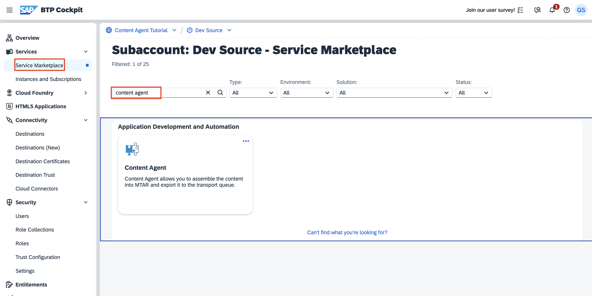

4. Select the three dots (...) on the tile, and choose **Create**.

    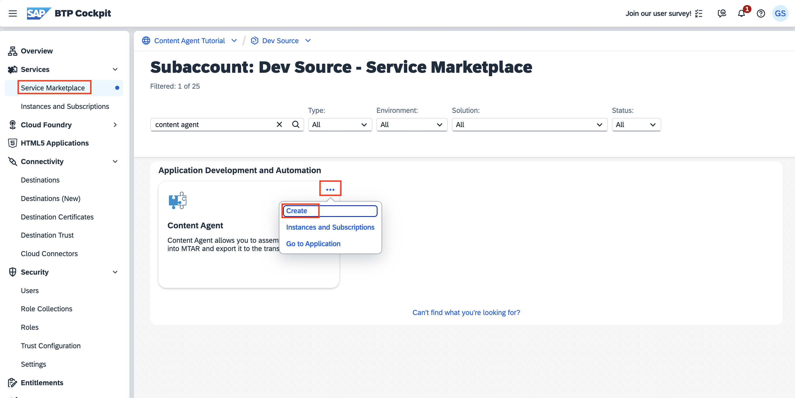

5. On the **New Instance or Subscription** dialog, from the **Plan** dropdown box, select **free** and choose **Create**.

    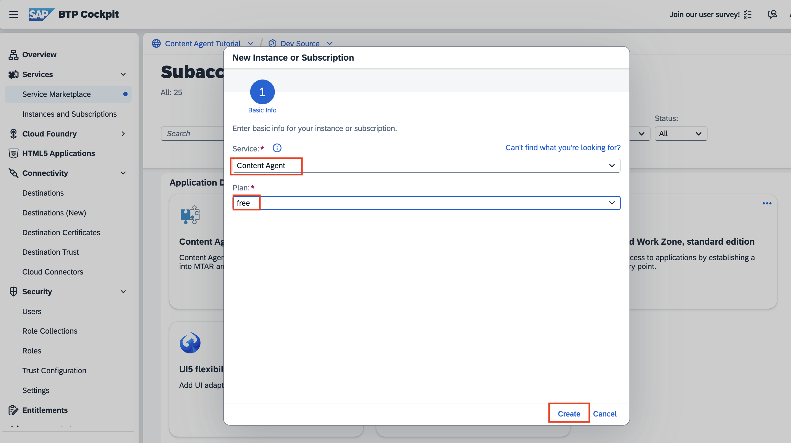

6. The subscription is in progress. Choose **View Subscription**.

    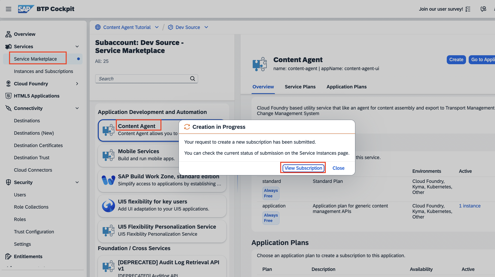

7. You've subscribed to the application. 

    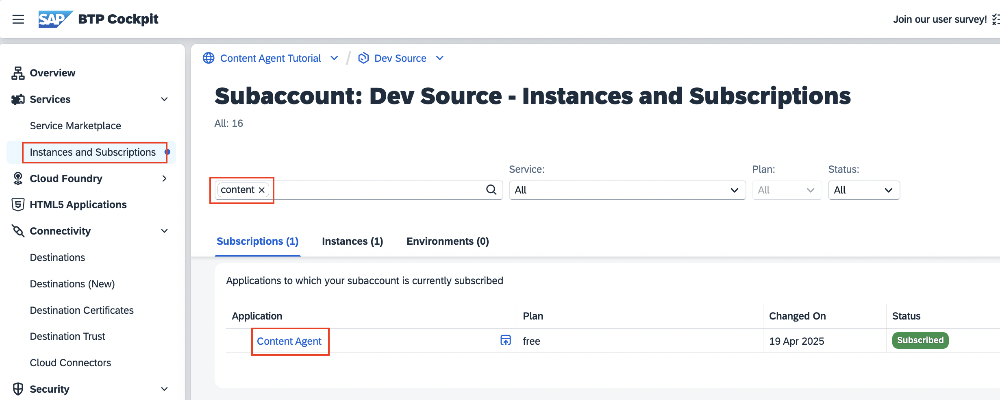

> See also on SAP Help Portal: [Initial Setup](https://help.sap.com/docs/content-agent-service/user-guide/subscribe-to-content-agent-service)

---
### Set Up Role Collections

After successful subscription, you need to configure user access to the application.  You can create role collections and assign roles to the role collections based on the application templates. Afterwards, you assign the role collections to users or user groups. 

1.  To use the delivered role collections, choose **Security > Role Collections** from the navigation on the left. Filter for role collections called *content agent*. The role collections are displayed. 

    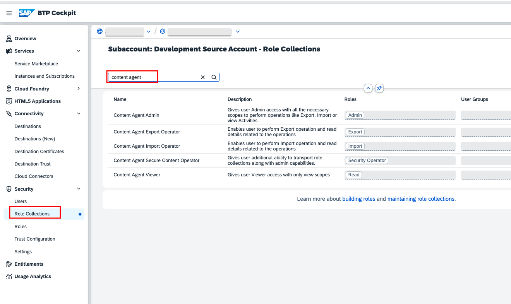

2. To assign users to the desired role collection, choose **Content Agent Admin**, from the list. In the details of the role collection, choose **Edit**.

    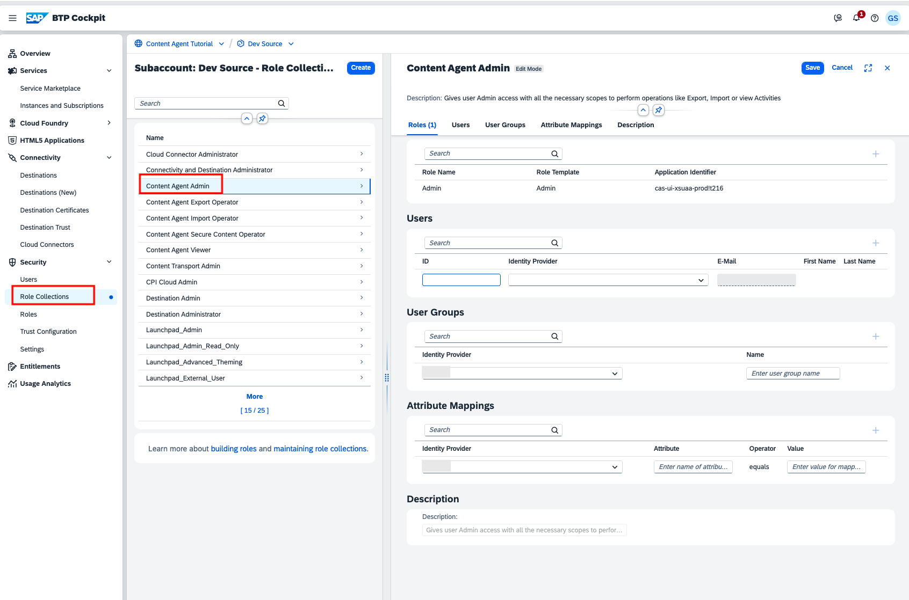

3. You can add individual users or user groups to the role collection. In the tutorial, add an individual user. To do this, select the identity provider (here: **Default identity provider**). In the ID field, enter an existing e-mail address and choose `Enter`. The **E-Mail** field is automatically filled with the selected e-mail address. Save your changes.

    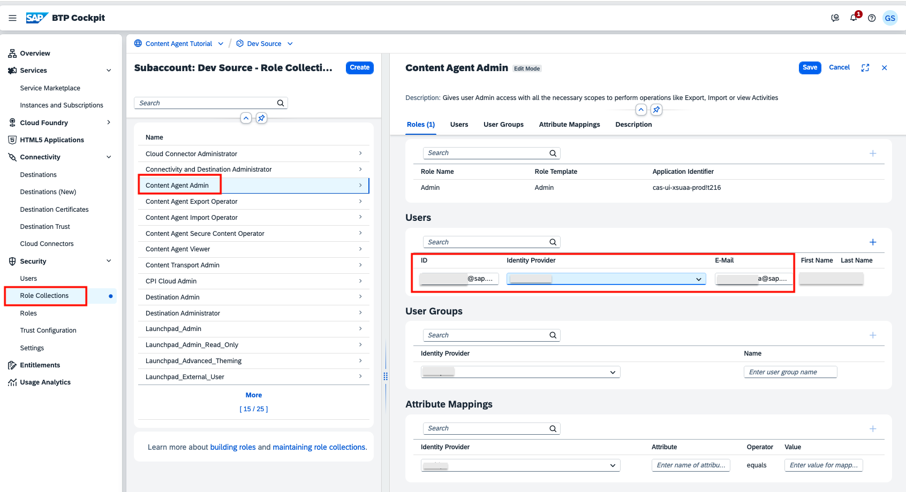

Repeat the steps, if you want to add users other role collections for other tasks, such as the **Content Agent Import Operator** for import tasks. 

See also on SAP Help Portal: [Setting Up Role Collections](https://help.sap.com/docs/content-agent-service/user-guide/assign-user-roles-and-permissions?locale=en-US)

---
### Verify access to Content Agent service

You should now be able to access the user interface of SAP Content Agent service. 

1. To check this, in your subaccount, choose **Services > Instances and Subscriptions**. In the **Subscriptions** section, choose the **Content Agent** link or the *Go to Application* icon to the right of it.

    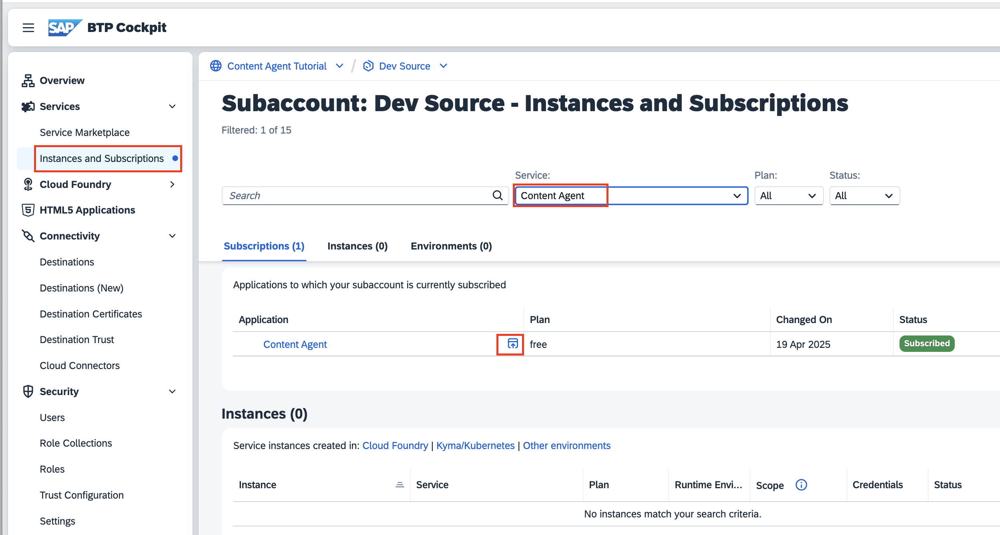

2. In a new tab, you should now see the **Overview** page of your SAP Content Agent service. Currently, the Activities Performed tile is empty as expected from a new instance. 	

     
    
---
### Get the Details of the SAP Cloud Transport Management Service Instance 

Get the service key details of the SAP Cloud Transport Management instance that you created as part of tutorial [Step 5 in Get Started with SAP Cloud Transport Management](https://developers-qa-blue.wcms-nonprod.c.eu-de-2.cloud.sap/tutorials/btp-transport-management-getting-started.html).

1. Go to the central administrative SAP BTP subaccount. To do this, click on the **Central Services** tile.

    
        
2. Choose **Instances and Subscriptions** and filter for **Cloud Transport Management** to get the service instance. Click on the key link to view credentials.

    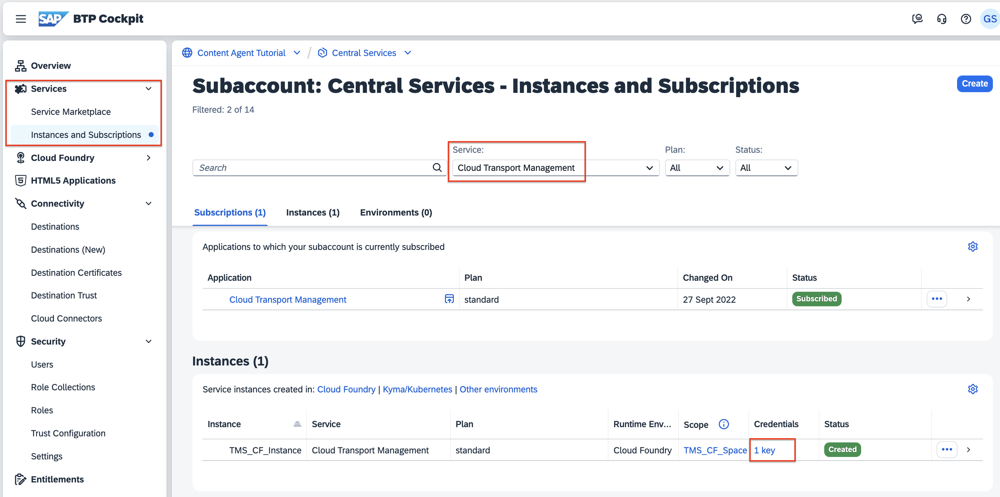

3. The key looks as follows. Leave the service key open so that you copy the required values in the next step, or note down the values of `uri` (you have to scroll down), as well as `clientid`, `clientsecret`, and `url` from the `uaa` section.   
   
    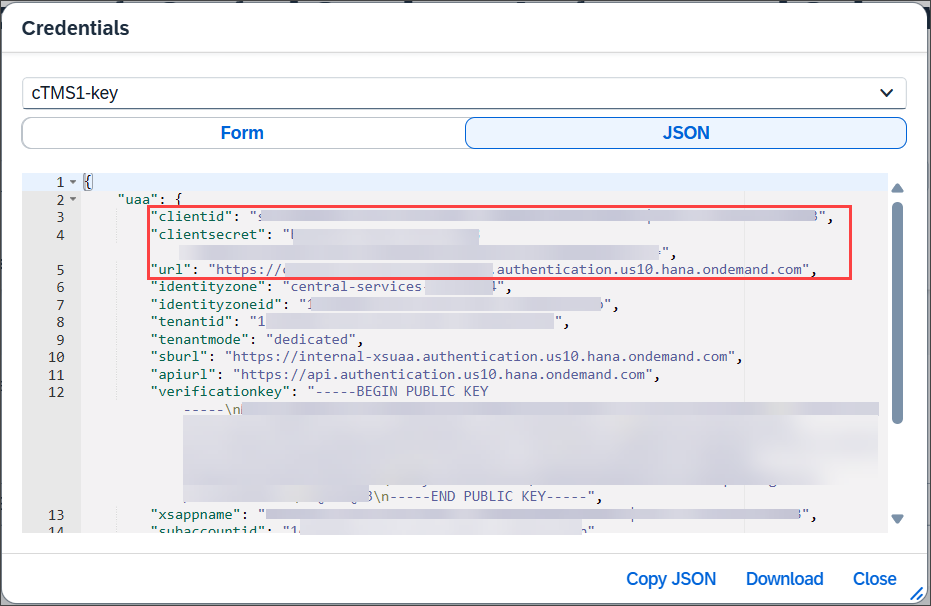
    
---
### Create Destination to Cloud Transport Management in source account 

The destination to SAP Cloud Transport Management service defines the endpoint of SAP Cloud Transport Management service that is used by SAP Content Agent for pushing the content to desired source node of transport route. The destination has the fixed name TransportManagementService.

1. Open the **source** subaccount in a new tab.

    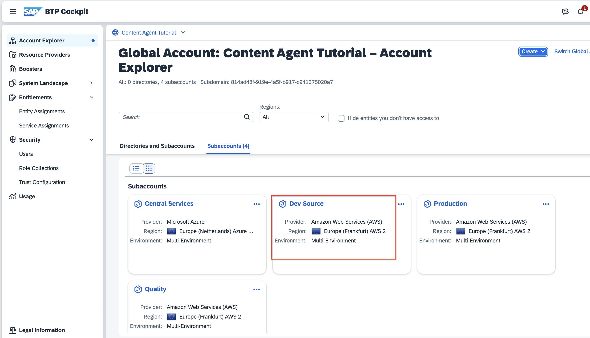
    
2. Under **Connectivity > Destinations** click on **Create Destination**.

    

3. In the **Destination Configuration** window, enter details for the following fields. 
    >Keep the values of fields not mentioned in the table unchanged.

    | Field | Value |
    | ---------- | ------------- |
    | **Name** | `TransportManagementService` |
    | **Description** | For example: `Destination to SAP Cloud Transport Management` |
    | **URL** | Enter the value of the `uri` from the service key details (scroll down to the bottom of the service key). For example: `https://transport-service-app-backend.ts.cfapps.us10.hana.ondemand.com` |
    | **Authentication** | Select **OAuth2ClientCredentials**. |
    | **Client ID** | Enter the value of `clientid` from the `uaa` section of the service key details. |
    | **Client Secret** | Enter the value of the `clientsecret` from the `uaa` section of the service key details. |
    | **Token Service URL** | Enter the value of `url` from the `uaa` section of the service key details and append `/oauth/token` to the URL. For example: `https://cpi-dev-12345678.authentication.us10.hana.ondemand.com/oauth/token` |

    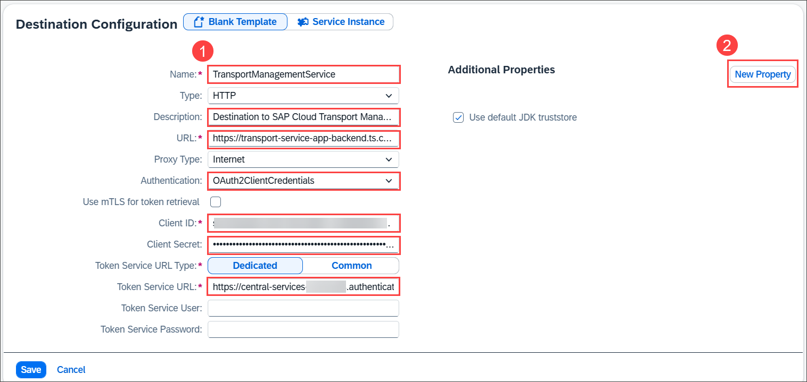

See also on SAP Help Portal: [Create TransportManagementService Destination](https://help.sap.com/docs/CONTENT_AGENT_SERVICE/ae1a4f2d150d468d9ff56e13f9898e07/eed66f35f9d148c8ae5b2d46ff097d8c.html)

---
### Create target node destination in central services account

You need to configure a transport destination so that SAP Cloud Transport Management knows about the target endpoint of the deployment process. This is usually the endpoint of the deploy service on Cloud Foundry.

1. You will use the Central Services subaccount that's subscribed to SAP Cloud Transport Management service.

	
2. In the Central Services subaccount, under Connectivity > Destinations click on *Create Destination*. 
	
	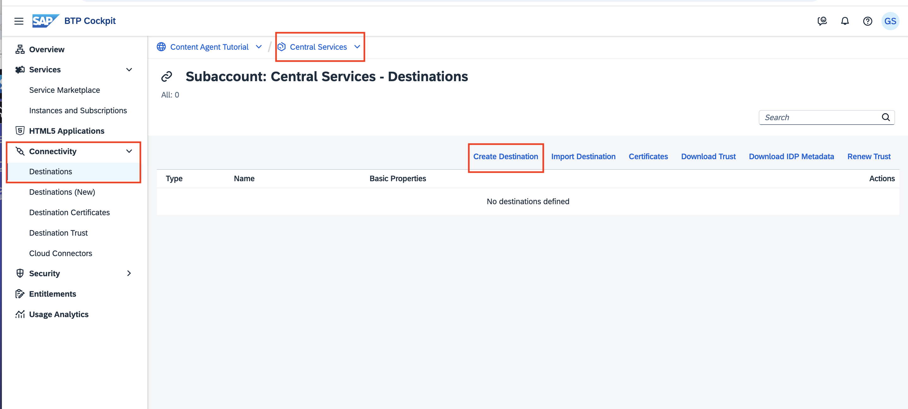
3. In the **Destination Configuration** window, enter details for the following fields and save the entries:

    | Field | Value |
    | ---------- | ------------- |
    | **Name** | Enter a name, for example: `Quality_Target_Node` |
    | **Description** | For example: `Destination for Deploy Service targeted on target BTP account for Mobile Service` |
    | **URL** | Specify the URL to the SAP Cloud Deployment service as the deploy end point of the destination `https://deploy-service.cf.<domain>/slprot/<myorg>/<myspace>/slp`  `<domain>`: Domain of your target subaccount derived from the Cloud Foundry API endpoint that you can find in the SAP BTP Cockpit in the Overview of your subaccount. `<myorg>/<myspace>`: Names of your org and space. For example `https://deploy-service.cf.eu10-004.hana.ondemand.com/slprot/Example%20Company%20Test%20Org/Example%20Company%20Test%20Space/slp` |
    | **Authentication** | Select **BasicAuthentication**. |
    | *User** | Specify the user name (usually, an email address) of the user that is used for the deployment. User must be a valid platform user on Cloud Foundry environment and it must have the role SpaceDeveloper in the target space. |
    | **Password** | Specify the password of the user. |

    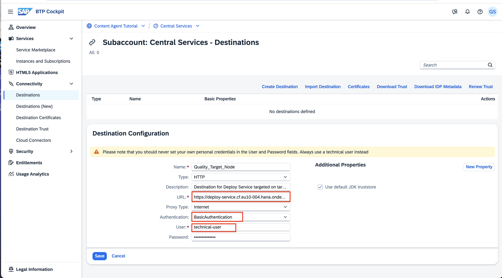
The destination was created.

> In the Cloud Transport Management application select the target node configuration, you assign the previously created transport destination pointing the target subaccount.

---
### Set up landscape in Cloud Transport Management application

---
## Use SAP Content Agent to export mobile apps to SAP Cloud Transport Management

1. Login to SAP Content Agent UI from the DEV account.

	

2. Navigate to the **Content Types** page to check status of *SAP Mobile service*. You should see a warning message *SAP Mobile service is active and ready for export.* Ignore the *Action Recommended* as in this scenario we do not perform direct import from Content Agent UI.  

    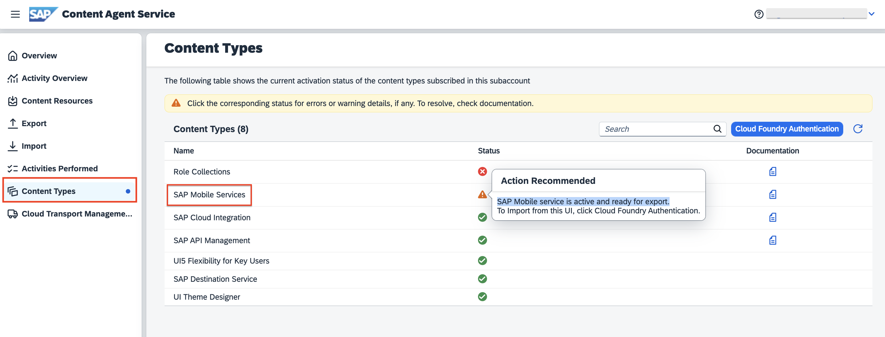
    
3. Check the status of SAP Cloud Transport Management is showing as "Connected" to verify the destination is configured correctly in the DEV account. 
Select the source node as the entry node of the transport route you want to choose. 

    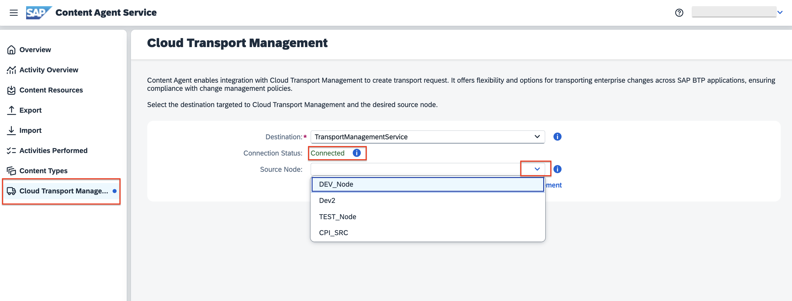

4. Go to the Export Wizard screen. Use the options to filter type as *Mobile Application* and search text using name of your app, for example *test*. 

	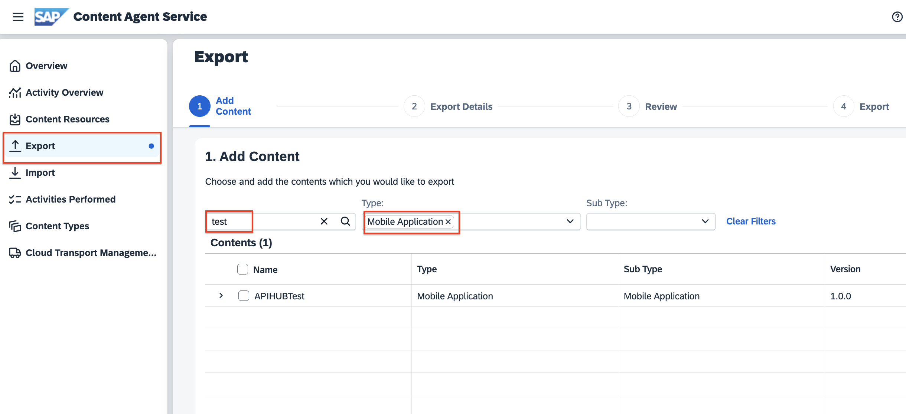

5. Select the mobile app from the list you want to export. Upon clicking the checkbox you can view the subcomponents of selected app where some mandatory components are pre-checked for you. Go to Step 2.

    	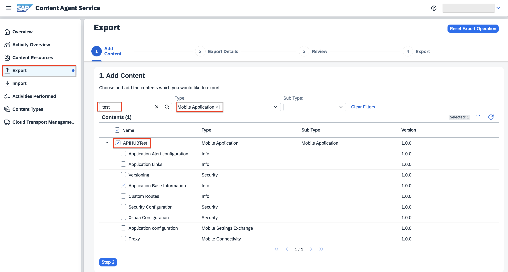
    	
6. Select the transport mode option as "SAP Cloud Transport Management" service. Choose the source node based on the entry node of desired transport route. Enter a description for creating the transport request. This would be visible in the SAP Cloud Transport Management transport requests view.

	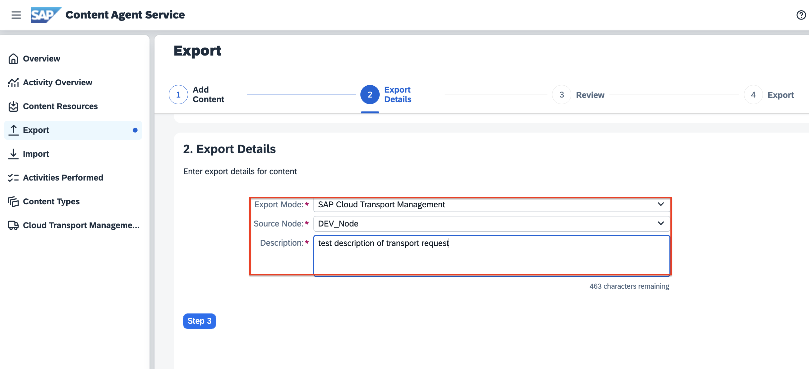
		
7. Review your selection and proceed to the next step. 

	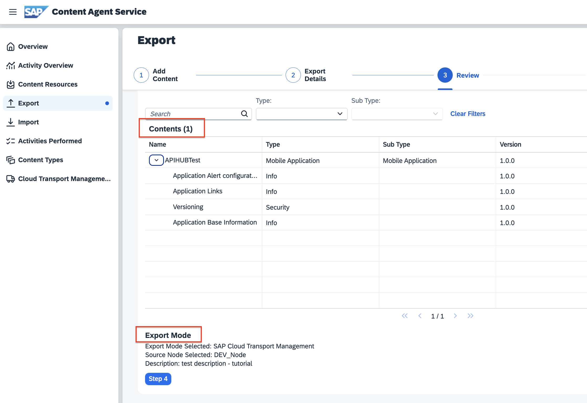

8. An asynchronous process is started and you can view the progress and messages. 	

	
	
---
### View the status of transport request

You can also use the "Activities Performed" page to see the past activities - export/ import done along with logs, content selected and transport information to track if the changes are deployed in the target account. 

1. Navigate to *Activities Performed* and select the activity for which you want to view further details

	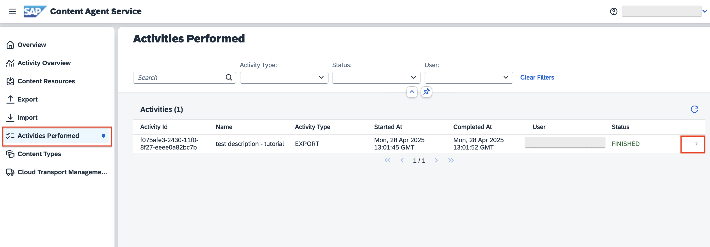
	
2. Select the tab *Activity Logs* to view the logs. You can also download them. 

	![Activity 2(screenshots/activity2.png)
	
3. Select the *Content Information* tab to view the mobile app details exported from source account with sub component information the activity for which you want to view further details

	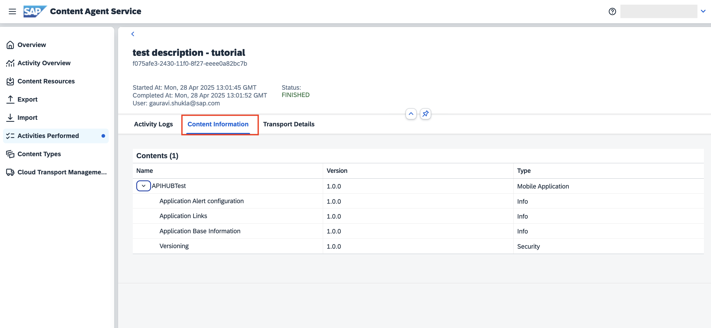
	
4. Select the *Transport Details* tab to see the the transport request status. You can also use the *View Transport Request ##* button to go to Cloud Transport Management UI and see further details.

	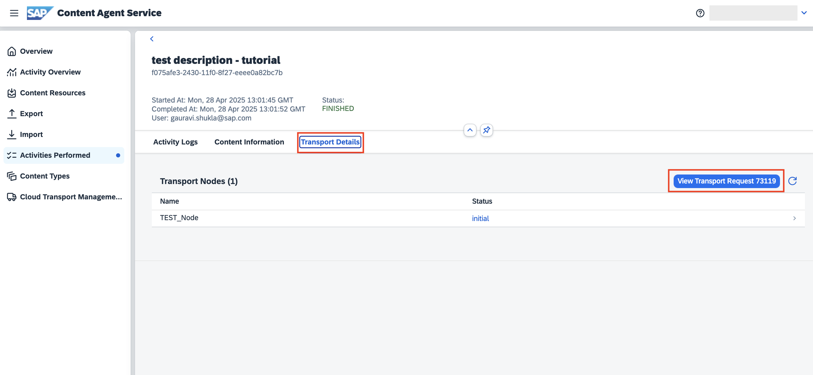

